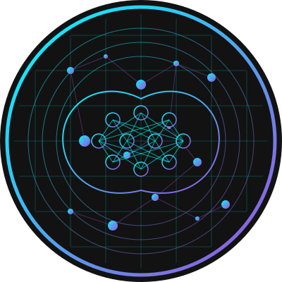

# AI Engineer Portfolio Website

A modern, responsive portfolio website for Alex, a Data Scientist and AI Engineer. Built with Flask, Bootstrap 5, and modern JavaScript.



## Features

- **Responsive Design**: Looks great on all devices
- **Dark Mode**: Modern dark theme with AI-lab aesthetic
- **Animated Elements**: Typing animation and particle background
- **Project Showcase**: Dynamic project cards with filtering
- **Contact Form**: Interactive form with validation
- **API Endpoint**: Ready for backend integration
- **SEO Optimized**: Meta tags and semantic HTML

## Tech Stack

- **Backend**: Python 3 + Flask
- **Frontend**: HTML5, CSS3, JavaScript
- **CSS Framework**: Bootstrap 5
- **Templating**: Jinja2
- **Icons**: Font Awesome 5
- **Fonts**: Google Fonts (Roboto Mono, Space Grotesk)
- **Animations**: Custom CSS and JavaScript

## Project Structure

```
├── app.py                 # Main Flask application
├── requirements.txt       # Python dependencies
├── data/
│   └── projects.json      # Project data
├── static/
│   ├── css/
│   │   └── style.css      # Custom styles
│   ├── js/
│   │   └── main.js        # JavaScript functionality
│   └── img/               # Images and SVGs
└── templates/
    ├── layout.html        # Base template
    ├── index.html         # Home page
    ├── projects.html      # Projects page
    ├── contact.html       # Contact page
    ├── 404.html           # Error page
    └── 500.html           # Server error page
```

## Setup Instructions

### Prerequisites

- Python 3.7+ installed
- pip (Python package manager)

### Local Development

1. **Clone the repository**

```bash
git clone https://github.com/yourusername/portfolio.git
cd portfolio
```

2. **Create a virtual environment (optional but recommended)**

```bash
# On Windows
python -m venv venv
venv\Scripts\activate

# On macOS/Linux
python3 -m venv venv
source venv/bin/activate
```

3. **Install dependencies**

```bash
pip install -r requirements.txt
```

4. **Run the application**

```bash
python app.py
```

5. **Open your browser**

Visit `http://127.0.0.1:5000/` to see the website.

## Deployment on Deta Space

This application is compatible with Deta Space for easy deployment.

1. **Install Deta CLI**

```bash
curl -fsSL https://get.deta.dev/cli.sh | sh
```

2. **Login to Deta**

```bash
deta login
```

3. **Initialize and deploy**

```bash
deta new --python portfolio
deta deploy
```

4. **Access your deployed application**

Deta will provide a URL where your application is deployed.

## Customization

### Adding Projects

Edit the `data/projects.json` file to add or modify projects. Each project should follow this structure:

```json
{
  "id": 1,
  "title": "Project Title",
  "description": "Project description text",
  "image": "img/project-image.jpg",
  "tags": ["Tag1", "Tag2"],
  "github_url": "https://github.com/username/project",
  "demo_url": "https://demo-link.com",
  "youtube_id": "YouTubeVideoID"
}
```

### Modifying Styles

Custom styles are in `static/css/style.css`. The website uses CSS variables for easy theming:

```css
:root {
  --primary: #9D4EDD;
  --secondary: #00FFFF;
  --dark: #121212;
  --darker: #0A0A0A;
  --light: #F8F9FA;
  --gray: #6C757D;
}
```

## License

MIT

## Author

Alex - Data Scientist & AI Engineer

---

For any questions or support, please contact alex@example.com"# portfolio" 
